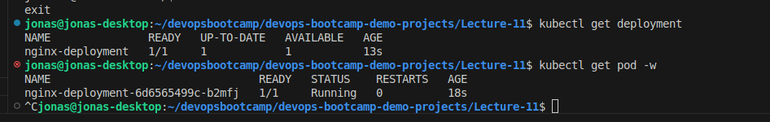
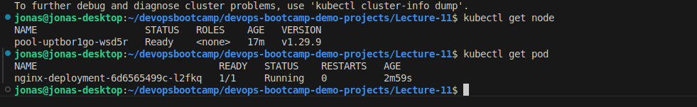

# Demo Projects - Kubernetes on AWS - EKS

## Deploy to EKS cluster from Jenkins Pipeline

1. first we have to install kubectl and aws-iam-authenticator (necessary for authentication with AWS and with EKS) on the jenkins controller node
2. As I run my jenkins controller within a container I adjust the Dockerfile so that kubectl is always available (even if we remove the container)
3. And lastely we need to configure credentials on our jenkins controller node which contain the aws secret and aws secret key
4. Install the eks cluster using the [install script](./install-eks-cluster.sh)
5. We also need to copy the local .kube/config file to the container respectively such as we have the proper connection information needed to connect to the eks cluster
For this we use the [iam config template](./iam-config.yaml) and fill in the respective information (which we get from our local kubec config file, which has been created be the eks cli tool)
And before that we need to access the container and create the .kube folder in the /var/jenkins_home directory.

``` bash
docker exec jenkins-controller sh -c "mkdir /var/jenkins_home/.kube"
docker cp kubeconfig jenkins_controller:/var/jenkins_home/.kube/config
```

6. Then we add the credentials for AWS on jenkins (to be able to connect to the eks cluster using the aws-iam-authenticator)
7. Afterwards we adjust our [Jenkinsfile](./Jenkinsfile) to be able to connect and deploy to our eks cluster.
8. Running the pipeline and checking the deployment/pod on the cluster shows the created resources:



## Deploy to DO cluster
1. After deploying the cluster on digital ocean we can use the config file provided on the DO web ui
2. But first we need to install the kubernetes cli plugin: (https://plugins.jenkins.io/kubernetes-cli/)
3. Afterwards we create the credentials in Jenkins
4. We use these credentials as described [here](https://plugins.jenkins.io/kubernetes-cli/)
5. We adjust the [Jenkinsfile](https://github.com/jkrisch/devops-bootcamp-demo-project-11/blob/deploy-on-do/Jenkinsfile)

Checking the DO cluster:



## Deploy to EKS cluster using dockerhub
1. after installing the gettext-base (using the [Jenkins Dockerfile](https://github.com/jkrisch/devops-bootcamp-demo-project-11/blob/ci/cd-eks-dockerhub/Dockerfile_Jenkins_Container))
2. We can adjust the [deployment and secret files](https://github.com/jkrisch/devops-bootcamp-demo-project-11/tree/ci/cd-eks-dockerhub/kubernetes) and use env var names
3. which we then substitute using the envsubst command in the [Jenkinsfile](https://github.com/jkrisch/devops-bootcamp-demo-project-11/blob/0ef891dd670ad470e444c71ed1dc4b871308ae1d/Jenkinsfile#L69)
5. Afterwards we create the secret for our dockerhub
6. and then use this secret in the [deployment](https://github.com/jkrisch/devops-bootcamp-demo-project-11/blob/ci/cd-eks-dockerhub/kubernetes/deployment.yaml)


